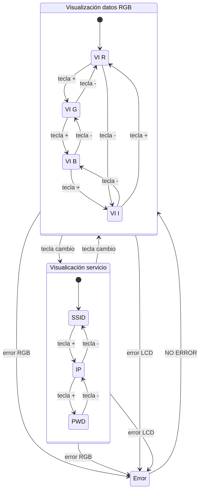

```mermaid
stateDiagram-v2
State1 : Visualización datos RGB
State2 : Visualicación servicio
State3: Error

State4: VI R
State5: VI G
State6: VI B
State7: VI I

State8: SSID
State9: IP
State10: PWD

State1 --> State2 : tecla cambio
State2 --> State1 : tecla cambio
State1 --> State3 : error RGB
State2 --> State3 : error RGB
State1 --> State3 : error LCD
State2 --> State3 : error LCD
State3 --> State1 : NO ERROR

state State1 {
    [*] --> State4
    State4 --> State5 : tecla +
    State5 --> State6: tecla +
    State6 --> State7: tecla +

    State7 --> State6 : tecla -
    State5 --> State4: tecla -
    State6 --> State5: tecla -

    State4 --> State7 : tecla -
    State7 --> State4 : tecla +
}

state State2 {
    [*] --> State8
    State8 --> State9 : tecla +
    State9 --> State10: tecla +

    State10 --> State9 : tecla -
    State9 --> State8: tecla -

}


```
